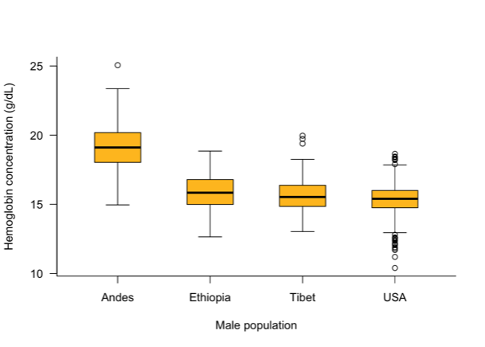

BIOL 327 / 327L (4 credits) 
Instructor: M. Drew LaMar (mdlama@wm.edu) 
Prerequisite: BIOL 225 and MATH 111 / 131, or by permission of instructor 

## Description

This course is an introduction to statistics and research design, including statistical inference, hypothesis testing, descriptive statistics and commonly used statistical tests. Emphasis is placed on the application of quantitative techniques in the biological sciences and solution methods via use of the computer.

## Sample lecture topics

Descriptive statistics, data visualization, hypothesis testing, probability, proportions (odds ratios, relative risk), chi-squared tests, goodness-of-fit tests, distributions, t-tests, ANOVA, correlation, regression, general linear models, generalized linear models, and experimental design
