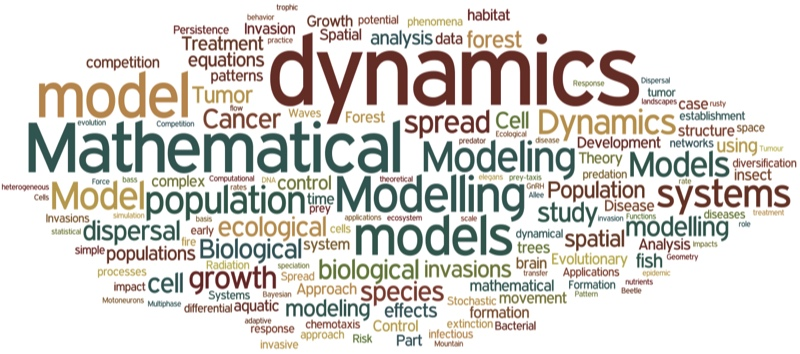

BIOL 325 / 325L (4 credits) 
Instructor: M. Drew LaMar (mdlama@wm.edu) 
Prerequisite: BIOL 225 and MATH 111 / 131, or by permission of instructor 

## Description

This course will be an overview of the mathematical tools used in quantitative analysis and modeling of biological systems. The goal is to develop quantitative reasoning skills through the use of mathematical modeling, statistical analysis, and computer simulation. The course covers both organismal and cellular biology, with a focus on the development of skills in model development, validation and refinement. MATLAB will be used in the computer labs, and no previous programming experience is required.

## Sample lecture topics

Dynamical systems, discrete/continuous models, differential equations, population growth, logistic model, Verhulst model, bifurcation diagrams, chaos, equations with delay, physiological mechanisms of drug elimination, infectious diseases, epidemic models, predator-prey interaction, Lotka-Volterra model, population genetics, Hardy-Weinberg law of genetic equilibrium, mutations, variation in populations, quantitative genetics, discrete/continuous random variables, probability distributions, statistical tests, hypothesis testing, cell signaling, gene regulation
